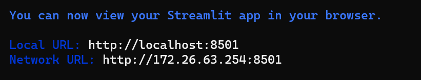

# AutoWSGR-GUI

本项目旨在构建用户友好的“战舰少女R全家桶”前端

后端功能参见：[AutoWSGR](https://github.com/huan-yp/Auto-WSGR) 


## 安装与使用

按照 [AutoWSGR](https://github.com/huan-yp/Auto-WSGR) 中的方案，配置好模拟器、战舰少女R游戏、python、依赖库。注意请使用方案中的“安装最新版”，老版本无法适配GUI。如果你过去已经使用过纯后端的老版本，也需要用下面的命令升级：

```bash
pip install -U git+https://github.com/huan-yp/Auto-WSGR.git@main
```

安装streamlit：

```bash
pip install streamlit
```

下载本项目：下载zip并解压缩，或者使用下面的命令：

```bash
git clone https://github.com/Nickydusk/AutoWSGR-GUI.git
```

运行：双击run.bat即可运行，也可以使用下面的命令：

```bash
streamlit run Hello.py
```

如果不出意外的话，WebUI将会自动打开。修改设置后，建议关闭UI并重新运行来确保生效。

steamlit会同时开启本地、远程的8501端口，你可以用第二个链接在局域网其他设备上访问WebUI。外网访问需要你的电脑有公网IP，感兴趣的可以自己查阅资料设置。



## 已有功能

- 对自动挂机脚本进行配置
- 运行自动挂机脚本

## 未来计划

- 配置、运行“决战”脚本

- 待后端加入了数据统计功能后，在UI界面以文字、图表等形式做汇总呈现